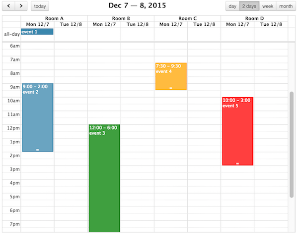

Determines if multi-day agenda or basic views should display resource columns. If so, renders resource headings above date headings.

Boolean, *default*: `false`

Beware this will affect *all* multi-day basic/agenda views, which might look bad for views that have many days. If you'd like to target a specific view, use [View-Specific Options](view-specific-options).

## Screenshot:

